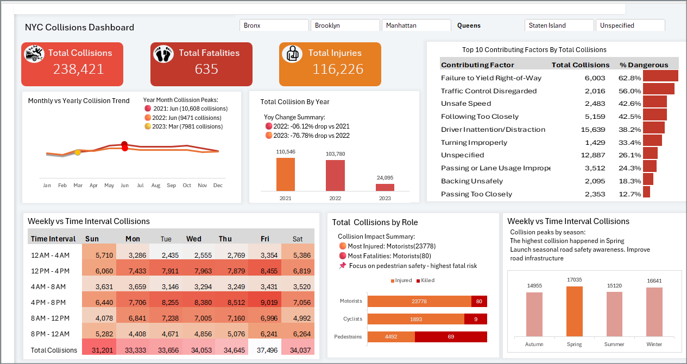

### New-York-City-Collisions-Dashboard
<html>
  <body>

This is an interactive Traffic Safety Dashboard built completely using Excel — based on a real dataset from the NYC Traffic 
  Safety Maven Analytics guided project. 

This project helped me gained knowledge on :
  <ul>
<li>Cleaning and preparing real-world traffic data </li>
<li>Creating interactive visuals like heatmaps, bar charts & trend lines using MS Excel</li>
  </ul>

Below is a screenshot of the dashboard:  

</body>
</html>
